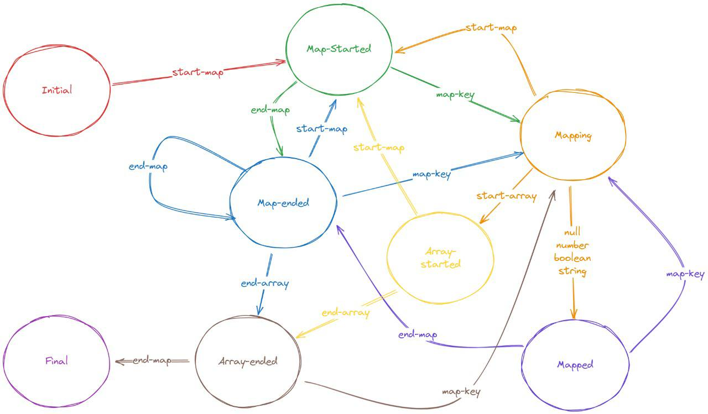

# Overview
The lightning network protocol is implemented by various different projects: LND, Core
Lightning, Eclair and LDK. Each implementation has their own default values for various public
pieces of information, which can be used to fingerprint them. This information can be useful for
an attacker looking to exploit vulnerabilities that are specific to one implementation (or version
of an implementation). This information can also be used to make informed decisions about
protocol upgrades and deprecating features.

Examples of default values:
- Feature bits that are distinct to an implementation, or a version of an implementation.
- Default routing policies such as fees and cltv delta.
- Default generated node aliases or RGB colors.

Input format:
- A json description of the public graph. See the ones we use to start developing this project on graphs directory. We get it running the following command on a LND node:
    - lncli describegraph

Output (nodenamer.csv) a CSV of node IDs, implementation names and version numbers:
- Node ID (string): the hex-encoded pubkey of a node in the graph.
- Implementation (string): LND, CLN, ECLR, LDK or UNKNOWN.
- Version (string): the implementation version or UNKNOWN.

Obs: The investigation done until the moment did not indicate that there is a reliable way to get the version of a lightning node implementation from feature bits, color or default policy

This project was proposed by Chaincode Hackathon, see the document here.

# Dependencies

- IJSON python Library

ijson is a Python library that provides a way to work with JSON data in a streaming manner. It allows you to parse large JSON documents efficiently without loading the entire document into memory. Instead, it iterates over the JSON data, allowing you to process it piece by piece.

Run the following command to install the `ijson` library

```sh
pip install ijson
```

# How to run

To run the Nodenamer is very simple, just clone the git repository on your machine.

```sh
git clone https://github.com/MPins/lightning-nodenamer
```

Go to the source directory and make sure you can run the `nodenamer.py` python program.

```sh
python nodenamer.py <json_file>
```

You can start using some json file examples on the graphs sub-directory. The nodenamer will create the nodenamer.csv as output.

# Screen Output

Besides the nodenamer.csv the program will show the following information on the screen

- Nodes: #of_nodes | Channels: #of_channels
- LND: #total of LND nodes
- CLN: #total of CLN nodes
- ECLR: #total of ECLR nodes
- LDK: #total of LDK nodes
- UNKNOWN NODES: #total of unknown nodes
- NO UPDATES NODES: #total of nodes which there is no updates on this json graph file
- NO FEATURE BIT NODES: #total of nodes which there is no feature bits on this json graph file

# Understanding the approach

The programm approach the node implementation identification using 3 layers of information:

- The first layer is considering only the features bit, in my opinion it is the strongest info we have, if it is possible to identify the implementation using the feature bits the program will not run the following two layers on the specific node.

- The second layer takes the unknown nodes from the first layer and try to figure them out looking at the default channel policies.

- Only the third layer of investigation is considering the default color, which in my opinion is the weakest information to be considered.

This way I think we minimize the chance of getting false positives.

# The State Machine

This is the State Machine tha was coded to read the Graph JSON file.




